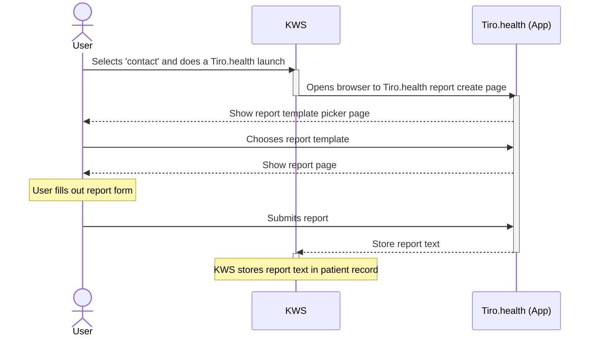
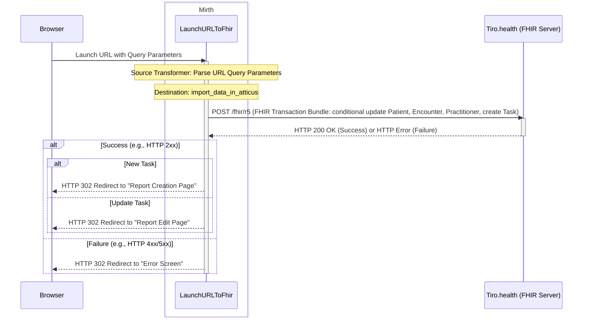

export const metadata = {
  title: 'Nexuzhealth KWS Integration',
  description:
    'This page focuses on the integration in Nexuzhealth KWS applications.',
}
import MirthChannel from '@/components/MirthChannel'

# Nexuzhealth KWS Integration

Integrating Tiro.health with Nexuzhealth KWS allows healthcare providers to launch Tiro.health for a selected patient/encounter directly from KWS and save the resulting report back into the KWS system. This integration streamlines workflows and ensures patient data is centralized.

An integration typically has three parts:

- A **context launch** launch from an **External Viewer** in KWS that allows users to launch Tiro.health inside the KWS application. This launch is handled by a **Mirth channel** that intercepts the URL and redirects the user to Tiro.health with the necessary patient and encounter context.

- A **report export** using a Mirth channel that exports the completed report back to KWS, ensuring that the report is stored in the patiets's record at the right encounter
This **Mirth channel** makes use of the KWS Import XML API to send the report back to KWS.

- A [Microsoft Entra ID](/entra-id) integration that allows users to authenticate with Tiro.health using their existing hospital credentials. This provides a seamless user experience and ensures that user data is securely managed.

## Integration Checklist
The following steps will help you setup the integration between Tiro.health and Nexuzhealth KWS:

1. Request Nexuzhealth for a unique *application identifier* to enable sending reports back to KWS.
2. Allow Tiro.health to connect to your hospital's Microsoft Entra ID for user authentication by following the [Entra ID integration guide](/identity-provider/microsoft-entra-id)
3. Once your data tenant is set up, Tiro.health will invite your hospital's system administrators by email. This email will contain instructions and credentials for your hospital's Tiro.health data tenant.
4. Download the Mirth Channels and import them into your Mirth Connect instance. [More info below](#mirth-configuration)
5. Configure the Mirth channels with your hospital's specific settings. [More info below](#mirth-configuration-map)
6. Set up the KWS External Viewer API to launch Tiro.health with the correct parameters. [More info on below](#kws-external-viewer-configuration)
7. Test the integration by launching Tiro.health from KWS, choose the demo template and submit a report. [More info in next section](#user-flow)

<a name="user-flow" className="m-0 leading-0" />
## User flow

The expected user flow after the integration is completed is as follows:



Please test this flow after completing the integration. If you encounter any issues, please contact us at [support@tiro.health](mailto:support@tiro.health)


## Context Launch

Tiro.health integrates using a KWS External Viewer and makes use of a Mirth channel to process the context parameters in the launch url. The Mirth channel improves data security and user experience.

More info about the Context Launch Channel can be found in the section about [Mirth Configuration](#mirth-configuration).


<a name="kws-external-viewer-configuration" className="m-0 leading-0" />

### KWS External Viewer Configuration

**Important:** The webviewer should be made visible to the relevant users (or groups) and with a logical name related to the use case.

The KWS External Viewer API needs to be configured as follows:

- **Base URL:** The default base URL is `http://localhost/launch`. It's crucial that this URL matches the domain where the Mirth server is running and that the path aligns with the Mirth source listener configuration.

  **Important:** Since the URL transmits patient data, ensure the Mirth channel is secured within your intranet or encrypted with TLS to protect sensitive information.

- **Parameters:** The following URL parameters are used to pass patient and encounter data from KWS to Tiro.health:

  | **URL Parameter** | **KWS Value**              | **Optional / Required** |
  | :---------------- | :------------------------- | :---------------------- |
  | `patient`         | `patient.eadnr`            | Required                |
  | `encounter`       | `contact.cnr`              | Required                |
  | `supervisor`      | `contact.supervisor.login` | Optional                |
  | `user`            | `user.login`               | Optional                |
  | `dob`             | `patient.birthDate`        | Optional                |
  | `sex`             | `patient.gender`           | Optional                |

  **Note:** The mapping of these parameters is fully customizable within the Mirth source transformer.

**Example of a final URL:**

`http://localhost/launch/?encounter=test-cnr3&dob=1941-12-12&sex=male&patient=test-ead3&supervisor=andrieskwslogin`

With this setup, users can select a contact in KWS and launch directly to app.tiro.health.

## Report Export

After a report is submitted in Tiro.health, a Mirth channel retrieves the report and exports it back to KWS. This is handled by the [Report Export Channel](#report-export-channel) which uses the KWS Import XML API to send the report back to KWS.

Hospitals will need to obtain a unique **'application identifier'** from Nexuzhealth for this export process.

Currently, only the plaintext human-readable report can be stored in KWS. Nexuzhealth KWS has no documented support for structured FHIR resources like QuestionnaireResponses, Conditions and Procedures. Tiro.health allows hospitals to archive these resources in a structured format in secondary systems like data warehouses or secured network drives. For more information, contact support@tiro.health.

<a name="mirth-configuration" className="m-0 leading-0" />
## Mirth Configuration
This section is directed towards your Mirth configuration expert and provides an overview of the Mirth channels used in the integration with KWS and general setup instructions for each channel.

<a name="context-launch-channel" className="m-0 leading-0" />
### Context Launch Channel

This channel intercepts the URL launched from KWS. Context passed in the URL is transformed into an encrypted HTTP POST request to Tiro.health, including patient and encounter context. Tiro.health matches patient and encounter identifiers with existing data in the system, allowing users to continue their work seamlessly. If the match succeeds, the user is redirected to Tiro.health with the appropriate context. An appropriate error message is shown if the match fails.

<MirthChannel
  name="Context Launch Channel"
  version="1.0.0"
  href="mailto:support@tiro.health?subject=KWS%20Mirth%20Channel%20Request&body=Dear%20Tiro.health%20support%2C%0A%0APlease%20send%20me%20the%20latest%20version%20of%20the%20KWS%20Mirth%20channels.%0A%0AThank%20you.%0A"
  description="Intercept the URL launched from KWS and redirect to Tiro.health with patient and encounter context."
/>

<details className="mt-2">
<summary>Schematic overview of the context launch channel</summary>



</details>


<a name="report-export-channel" className="m-0 leading-0" />
### Report Export Channel

This channel fetches the report submitted in Tiro.health and exports it back to KWS using the KWS Import XML API. It ensures that the report is stored in the patient's record using the correct identifiers, allowing for easy access and retrieval.

<MirthChannel
  name="Context Launch Channel"
  version="1.0.0"
  href="mailto:support@tiro.health?subject=KWS%20Mirth%20Channel%20Request&body=Dear%20Tiro.health%20support%2C%0A%0APlease%20send%20me%20the%20latest%20version%20of%20the%20KWS%20Mirth%20channels.%0A%0AThank%20you.%0A"
  description="Intercept the URL launched from KWS and redirect to Tiro.health with patient and encounter context."
/>

<details className="mt-2">
<summary>Schematic overview of the report export channel</summary>

  This Mirth channel contains two main components:
  1. A **Post-Submit Redirect Listener** that handles the redirect after report submission in Tiro.health.
  2. A **FHIR Bundle to KWS Transformer** that processes the FHIR bundle and sends the report to KWS in the required XML format.

  ```mermaid
  sequenceDiagram
  participant Browser
  participant Tiro.health backend
  box Mirth
  participant PostSubmitRedirectListener
  participant FhirBundleToKWS
  end
  participant KWS API

  Note over Browser: After report submission, Tiro redirects to:<br/>http://localhost:8081/submit?response=QuestionnaireResponse/11427

  Browser->>PostSubmitRedirectListener: GET /submit?response=QuestionnaireResponse/11427

  Note over PostSubmitRedirectListener: Extract QuestionnaireResponse ID from URL

  PostSubmitRedirectListener->>Tiro.health backend: "GET /fhir/r5/QuestionnaireResponse?<br/>_id={id}&_include=QuestionnaireResponse:subject&_include=QuestionnaireResponse:encounter"
  Tiro.health backend-->>PostSubmitRedirectListener: FHIR Bundle (QR + Patient + Encounter)

  PostSubmitRedirectListener->>FhirBundleToKWS: Route collection bundle
  FhirBundleToKWS-->>PostSubmitRedirectListener: XML response with EAD, CNR, report text

  Note over PostSubmitRedirectListener: Parse XML response to extract:<br/>- EAD Number<br/>- Contact Number<br/>- Report Text

  PostSubmitRedirectListener->>Browser: HTML page (success/error) with submission details

  opt Optional: Delete existing report in KWS
      FhirBundleToKWS->>KWS API: MLLP delete XML
  end

  FhirBundleToKWS->>KWS API: MLLP create XML
  Note over KWS API: Report created in KWS
  ```

</details>

Please contact [support@tiro.health](mailto:support@tiro.health) if you need assistance with the Mirth channel configuration or if you have any questions about the integration process.


<a name="mirth-configuration-map" className="m-0 leading-0" />
### Setting Up Configuration Map

The Mirth channels require a configuration map to store environment-specific settings:

1. Navigate to **Settings** > **Configuration Map** in the Mirth Connect Administrator.
2. Extend the configuration map with the following key-value pairs:

| Key | Description | Example Value |
|-----|-------------|--------------|
| `tiroHealthServerUrl` | Base URL for Tiro.health API | `https://reports.tiro.health` |
| `tiroHealthAppUrl` | Base URL for Tiro.health application | `https://app.tiro.health` |
| `tiroHealthAppNaam` | KWS application identifier for Tiro.health | `tiro-health` |
| `tiroHealthZiekenhuis` | Hospital identifier for KWS | `my-hospital` |
| `tiroHealthClientId` | Client ID for Tiro.health API access | `my-client-id` |
| `tiroHealthClientSecret` | Client secret for Tiro.health API access | `my-client-secret` |

3. Click **Save** to create the configuration map.

You can reference these values in your Mirth channels using the `configurationMap` object, e.g. `configurationMap.get('tiroHealthServerUrl')`, in JavaScript code within transformers and filters.


### Setting Up SSL for Tiro.health

To ensure secure communication between Mirth Connect and external systems like Tiro.health, you need to configure SSL/TLS settings. This guide focuses on using the NextGen Connect SSL Manager. However, other plugins exists or even using keytool is possible.

1. Navigate to **Settings** in the Mirth Connect Administrator.
2. Select the **SSL Manager** tab.
3. Normally, the default java truststore should be sufficient to trust the Tiro.health backend server. However, if that is not the case, you can import the Tiro.health backend server root certificates.
4. Click **Save Changes** to apply the SSL configuration.

Mirth destinations that connect with the Tiro.health backend server can also configure the SSL destination connector. We recommend the following settings:
-  'Server Certificate Validation' should be enabled
-  'Trusted Server Certificates' should be the java truststore or our root certificate that was imported earlier
-  'Hostname Verification' should be enabled
-  'Subject DN validation' should be enabled
-  'Allow expired certificates' should be 'No'
-  'Enabled protocols' should be TLS 1.3 or higher

With the NextGen Advanced Alerting Mirth plugin it is possible to get alerts when the certificate is going to expire. However, this is optional.