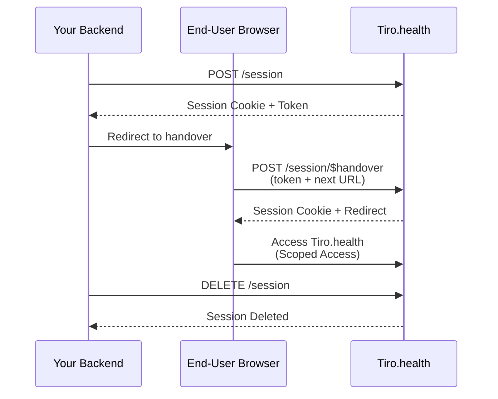

export const metadata = {
  title: 'Session Management API',
  description:
    'Learn how to create and manage user sessions programmatically with the Tiro.health Session Management API for Capture API customers.',
}

export const sections = [
  { title: 'Overview', id: 'overview' },
  { title: 'Session Lifecycle', id: 'session-lifecycle' },
  { title: 'Create a Session', id: 'create-a-session' },
  { title: 'Session Handover', id: 'session-handover' },
  { title: 'Get Session Information', id: 'get-session-information' },
  { title: 'Delete a Session', id: 'delete-a-session' },
  { title: 'Scope-based Access Control', id: 'scope-based-access-control' },
  { title: 'FHIR Context', id: 'fhir-context' },
  { title: 'Security Considerations', id: 'security-considerations' },
]

# Session Management API

The Session Management API allows Capture API customers to programmatically create and manage user sessions with fine-grained access control through scopes. {{ className: 'lead' }}

---

## Overview

The Session Management API is designed for EHR and LIS systems that integrate with Tiro.health using the Capture API. It enables you to:

- **Create sessions** programmatically with specific scopes and FHIR context
- **Control access** to resources throughout the session lifetime using scope-based permissions
- **Handover sessions** to end-users in a browser environment
- **Terminate sessions** when the user logs out or the session expires

This API is particularly useful when you need to:
- Launch Tiro.health forms with pre-configured patient and encounter context
- Restrict what data users can access during a session
- Integrate Tiro.health into your application's authentication flow
- Provide seamless user experience with session continuity

---

## Session Lifecycle

A typical session follows this lifecycle:

1. **Session Creation**: Your backend calls `POST /session`, optionally including scopes and FHIR context (Patient, Encounter)
2. **Browser Handover**: The end-user's browser submits the session token to `POST /session/$handover` via form POST
3. **Session Activation**: The session is activated, a secure cookie is set, and the user is redirected to Tiro.health
4. **Active Session**: The user operates within Tiro.health with access controlled by the session's scopes
5. **Session Termination**: The session is deleted via `DELETE /session` (equivalent to logout) or expires automatically



---

## Create a Session {{ tag: 'POST', label: '/session' }}

<Row>
  <Col>

Creates a new authenticated session for an end-user. This endpoint can optionally include FHIR context and scope restrictions.

### Request Body

<Properties>
  <Property name="scope" type="string">
    Space-separated list of requested scopes (e.g., `"patient/Patient.read patient/Observation.write"`). These scopes control what data the user can access during the session.
  </Property>
  <Property name="patient" type="integer">
    FHIR server ID of the patient to associate with this session.
  </Property>
  <Property name="encounter" type="integer">
    FHIR server ID of the encounter to associate with this session.
  </Property>
  <Property name="fhirContext" type="array">
    Array of FHIR context items using **external identifiers** to specify Patient and Encounter resources. Use this when integrating with systems that use different identifier namespaces. Each item should include `role: "launch"` to indicate the primary launch context. See [FHIR Context](#fhir-context) for details.
  </Property>
  <Property name="deployment_mode" type="string">
    Either `"embedded"` or `"standalone"`. Defaults to `"embedded"`.
  </Property>
  <Property name="smart_web_messaging_handle" type="string">
    Optional handle for SMART Web Messaging correlation.
  </Property>
  <Property name="smart_web_messaging_origin" type="string">
    Optional origin for SMART Web Messaging target.
  </Property>
</Properties>

  </Col>
  <Col sticky>

    <CodeGroup title="Create Session Request">

    ```bash {{ title: 'cURL' }}
    curl -X POST https://reports.tiro.health/session \
      -H "Content-Type: application/json" \
      -d '{
        "scope": "patient/Patient.read patient/Observation.write",
        "patient": 123,
        "deployment_mode": "embedded"
      }'
    ```

    ```csharp {{ title: 'C#' }}
    var client = new HttpClient();

    var payload = new {
      scope = "patient/Patient.read patient/Observation.write",
      patient = 123,
      deployment_mode = "embedded"
    };

    var response = await client.PostAsJsonAsync(
      "https://reports.tiro.health/session",
      payload
    );
    ```

    </CodeGroup>

  </Col>
</Row>

---

## Session Handover {{ tag: 'POST', label: '/session/$handover' }}

<Row>
  <Col>

The handover endpoint completes the session activation flow by consuming a one-time session token and setting the authentication cookie in the end-user's browser. This is typically called automatically when the user is redirected from your system to Tiro.health.

### Form Parameters

<Properties>
  <Property name="token" type="string">
    The session token received from the session creation step. This token is single-use and expires after 5 minutes.
  </Property>
  <Property name="next" type="string">
    The URL to redirect the user to after successful session activation (typically the Tiro.health application URL).
  </Property>
</Properties>

  </Col>
  <Col sticky>

    <CodeGroup title="Session Handover">

    ```html {{ title: 'HTML Form' }}
    <form action="https://reports.tiro.health/session/$handover"
          method="POST">
      <input type="hidden" name="token" value="<session_token>" />
      <input type="hidden" name="next"
             value="https://app.tiro.health/reports/edit?response=QuestionnaireResponse/example" />
      <button type="submit">Continue to Tiro.health</button>
    </form>
    ```

    ```bash {{ title: 'cURL' }}
    curl -X POST https://reports.tiro.health/session/\$handover \
      -d "token=<session_token>" \
      -d "next=https://app.tiro.health/reports/edit?response=QuestionnaireResponse/example" \
      -L
    ```

    </CodeGroup>

    ```json {{ title: 'Response (303 See Other)' }}
    // Redirects to the 'next' URL with session cookie set
    Location: https://app.tiro.health/reports/edit?response=QuestionnaireResponse/example
    Set-Cookie: auth_session=<session_id>; HttpOnly; Secure; SameSite=Strict
    ```

  </Col>
</Row>

---

## Get Session Information {{ tag: 'GET', label: '/session' }}

<Row>
  <Col>

Retrieves information about the current authenticated session. This endpoint requires a valid session cookie.

### Response Fields

<Properties>
  <Property name="id" type="integer">
    Unique identifier for the session.
  </Property>
  <Property name="user" type="object">
    User information including practitioner details.
  </Property>
  <Property name="data_tenant" type="object">
    Data tenant associated with this session.
  </Property>
  <Property name="active" type="boolean">
    Whether the session is currently active.
  </Property>
  <Property name="expired_timestamp" type="datetime">
    When the session expires.
  </Property>
  <Property name="created_timestamp" type="datetime">
    When the session was created.
  </Property>
  <Property name="last_modified_timestamp" type="datetime">
    When the session was last modified.
  </Property>
  <Property name="deployment_mode" type="string">
    Either `"embedded"` or `"standalone"`.
  </Property>
  <Property name="fhir_server" type="object">
    FHIR server address and granted scopes for this session.
  </Property>
</Properties>

  </Col>
  <Col sticky>

    <CodeGroup title="Get Session Request">

    ```bash {{ title: 'cURL' }}
    curl https://reports.tiro.health/session \
      -H "Cookie: auth_session=<session_id>"
    ```

    ```csharp {{ title: 'C#' }}
    var handler = new HttpClientHandler();
    handler.CookieContainer.Add(
      new Uri("https://reports.tiro.health"),
      new Cookie("auth_session", "<session_id>")
    );
    var client = new HttpClient(handler);

    var response = await client.GetAsync(
      "https://reports.tiro.health/session"
    );
    ```

    </CodeGroup>

    ```json {{ title: 'Response (200 OK)' }}
    {
      "id": 12345,
      "user": {
        "id": 67890,
        "email": "doctor@hospital.org",
        "name": "Dr. Smith"
      },
      "data_tenant": {
        "id": 1,
        "name": "Hospital Name"
      },
      "active": true,
      "expired_timestamp": "2025-11-20T18:00:00Z",
      "created_timestamp": "2025-11-20T10:00:00Z",
      "last_modified_timestamp": "2025-11-20T10:00:00Z",
      "deployment_mode": "embedded",
      "fhir_server": {
        "address": "https://fhir.hospital.org/R4",
        "scope": ["patient/Patient.read", "patient/Observation.write"]
      }
    }
    ```

  </Col>
</Row>

---

## Delete a Session {{ tag: 'DELETE', label: '/session' }}

<Row>
  <Col>

Terminates the current session, marking it as inactive and removing the authentication cookie. This is equivalent to logging the user out.

After deletion, the session can no longer be used and any subsequent requests with the session cookie will be rejected.

  </Col>
  <Col sticky>

    <CodeGroup title="Delete Session Request">

    ```bash {{ title: 'cURL' }}
    curl -X DELETE https://reports.tiro.health/session \
      -H "Cookie: auth_session=<session_id>"
    ```

    ```csharp {{ title: 'C#' }}
    var handler = new HttpClientHandler();
    handler.CookieContainer.Add(
      new Uri("https://reports.tiro.health"),
      new Cookie("auth_session", "<session_id>")
    );
    var client = new HttpClient(handler);

    var response = await client.DeleteAsync(
      "https://reports.tiro.health/session"
    );
    ```

    </CodeGroup>

    ```json {{ title: 'Response (204 No Content)' }}
    // Empty response body
    ```

  </Col>
</Row>

---

## Scope-based Access Control

Scopes define what actions and resources a user can access during their session. When you create a session with specific scopes, those restrictions are enforced throughout the entire session lifetime.

### Scope Format

Scopes follow the FHIR SMART on FHIR format: `<context>/<resourceType>.<action>`

**Supported formats:**
- `patient/<resourceType>.<action>` - Patient-scoped access to specific resource types
- `system/<resourceType>.<action>` - System-wide access to specific resource types

**Examples:**
- `patient/Patient.read` - Read access to patient resources in the patient's compartment
- `patient/Observation.write` - Write access to observations in the patient's compartment
- `patient/Encounter.read` - Read access to encounters in the patient's compartment
- `system/Patient.read` - System-wide read access to all patient resources
- `patient/Patient.read patient/Observation.write` - Multiple scopes can be combined

### How Scopes Work

When a session is created with scopes:

1. The scopes are stored with the session
2. All FHIR API requests during the session are checked against these scopes
3. Requests for resources or actions not covered by the scopes are denied
4. Scopes remain active until the session is deleted or expires

### Example: Restricted Session

```bash
# Create a read-only session for patient data
curl -X POST https://reports.tiro.health/session \
  -H "Content-Type: application/json" \
  -d '{
    "scope": "patient/Patient.read patient/Encounter.read patient/Observation.read",
    "patient": 123
  }'
```

In this session, the user can read patient, encounter, and observation data but cannot modify anything. Any attempt to create or update resources will be denied.

---

## FHIR Context

Sessions can include FHIR context to associate them with specific patients and encounters. There are two ways to specify context:

### Using Direct IDs

When you have the internal FHIR server IDs, use the direct `patient` and `encounter` parameters:

```json
{
  "patient": 123,
  "encounter": 456
}
```

This is the simplest approach when your system already uses Tiro.health's FHIR server IDs.

### Using External Identifiers with fhirContext

When integrating with external systems that use their own identifier namespaces, use the `fhirContext` array following the [SMART on FHIR launch context specification](https://hl7.org/fhir/smart-app-launch/scopes-and-launch-context.html#fhircontext-exp):

```json
{
  "fhirContext": [
    {
      "identifier": {
        "system": "http://hospital.org/patient-ids",
        "value": "P-12345"
      },
      "type": "Patient",
      "role": "launch"
    },
    {
      "identifier": {
        "system": "http://hospital.org/encounter-ids",
        "value": "E-67890"
      },
      "type": "Encounter",
      "role": "launch"
    }
  ]
}
```

**Key features:**
- **`identifier`**: Specifies the external system identifier (system + value)
- **`type`**: Resource type (Patient or Encounter)
- **`role: "launch"`**: Indicates this is the primary launch context for the session

### Identifier Resolution

When using external identifiers, Tiro.health will:

1. Look up existing resources with matching identifiers
2. Create new resources if no match is found
3. Associate the session with the resolved or created resources

This enables seamless cross-system integration without requiring ID mapping or pre-registration of resources.

---

## Security Considerations

### Token Expiration

- **Session tokens** expire after 5 minutes and are single-use only
- **Active sessions** have configurable expiration times
- Expired tokens cannot be used for handover and will return a 401 error

### Token Security

- Session tokens should be treated as sensitive credentials
- Tokens are deleted immediately after successful handover (one-time use)
- Always use HTTPS when transmitting tokens
- Never log or store session tokens

### Cookie Security

Session cookies are configured with security best practices:
- `HttpOnly` - Cannot be accessed via JavaScript
- `Secure` - Only transmitted over HTTPS
- `SameSite=Strict` - Protection against CSRF attacks
- Scoped to `tiro.health` domain

### Best Practices

1. **Minimize scope** - Only grant the minimum permissions needed
2. **Short-lived tokens** - Use the default 5-minute token expiration
3. **Secure token transmission** - Pass tokens via secure form POST, not URL parameters
4. **Immediate handover** - Complete the handover flow as quickly as possible
5. **Explicit logout** - Always delete sessions when users log out
6. **Monitor sessions** - Track active sessions and their expiration times
