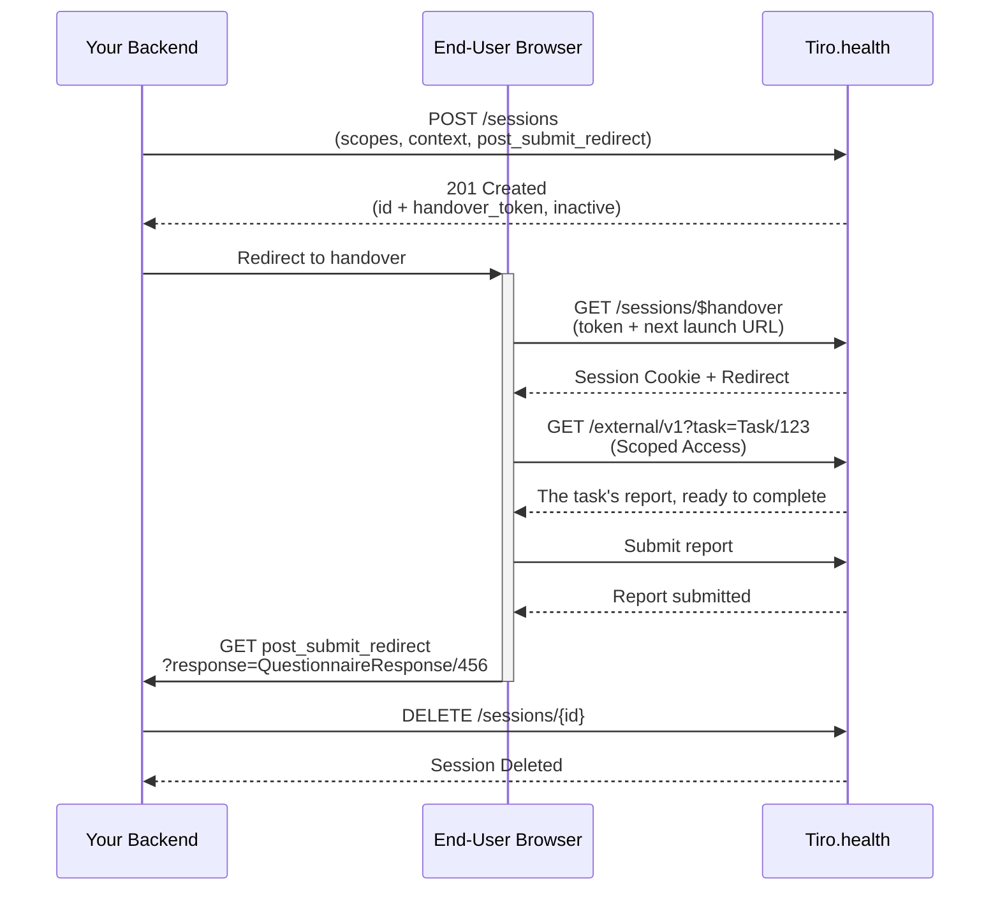

export const metadata = {
  title: 'Session Management API',
  description:
    'Learn how to create and manage user sessions programmatically with the Tiro.health Session Management API for Capture API customers.',
}

export const sections = [
  { title: 'Overview', id: 'overview' },
  { title: 'Session Lifecycle', id: 'session-lifecycle' },
  { title: 'Create a Session', id: 'create-a-session' },
  { title: 'Session Handover', id: 'session-handover' },
  { title: 'Launch URL', id: 'launch-url' },
  { title: 'Get Session Information', id: 'get-session-information' },
  { title: 'Delete a Session', id: 'delete-a-session' },
  { title: 'Scope-based Access Control', id: 'scope-based-access-control' },
  { title: 'FHIR Context', id: 'fhir-context' },
  { title: 'Security Considerations', id: 'security-considerations' },
]

# Session Management API

The Session Management API allows Capture API customers to programmatically create and manage user sessions with fine-grained access control through scopes. {{ className: 'lead' }}

---

## Overview

The Session Management API is designed for EHR and LIS systems that integrate with Tiro.health using the Capture API. It enables you to:

- **Create sessions** programmatically with specific scopes and FHIR context
- **Control access** to resources throughout the session lifetime using scope-based permissions
- **Handover sessions** to end-users in a browser environment
- **Terminate sessions** when the user logs out or the session expires

This API is particularly useful when you need to:
- Launch Tiro.health forms with pre-configured patient and encounter context
- Restrict what data users can access during a session
- Integrate Tiro.health into your application's authentication flow
- Provide seamless user experience with session continuity

### Base URL

The Session Management API is served by the Tiro.health Auth Service:

```text
https://auth.tiro.health
```

### Authentication

`POST /sessions`, `GET /sessions/{id}` and `DELETE /sessions/{id}` authenticate with your API key over [HTTP Basic](/fhir/authentication#basic-authentication-api-key) — the base64 encoding of `client_id:client_secret`. The two handover endpoints are unauthenticated by design: they are opened by the end-user's browser and carry a single-use token instead.

The API key must belong to a [data tenant](/guides/data-tenants), otherwise session creation fails with `403`.

---

## Session Lifecycle

A typical session follows this lifecycle:

1. **Session Creation**: Your backend calls `POST /sessions`, optionally including scopes, FHIR context (Patient, Encounter) and a `post_submit_redirect`. The session is created **inactive** and comes back with a single-use `handover_token`
2. **Browser Handover**: The end-user's browser is sent to `/sessions/$handover` with that token and a `next` [Launch URL](#launch-url). The session is activated, a secure cookie is set in the browser, and the user lands on the task
3. **Completing the Report**: The user fills in and submits the report, with access controlled by the session's scopes
4. **Return to Your System**: On submit, Tiro.health sends the browser back to your `post_submit_redirect`, with the resulting `QuestionnaireResponse` appended as a query parameter
5. **Session Termination**: Your backend deletes the session via `DELETE /sessions/{id}` (equivalent to logout), or it expires automatically

The session only becomes usable at step 2 — the handover is what activates it and binds it to the end-user's browser. Your backend never holds the session cookie.


```mermaid
sequenceDiagram
    participant Backend as Your Backend
    participant Browser as End-User Browser
    participant Tiro as Tiro.health

    Backend->>Tiro: POST /sessions<br/>(scopes, context, post_submit_redirect)
    Tiro-->>Backend: 201 Created<br/>(id + handover_token, inactive)
    Backend->>+Browser: Redirect to handover
    Browser->>Tiro: GET /sessions/$handover<br/>(token + next launch URL)
    Tiro-->>Browser: Session Cookie + Redirect
    Browser->>Tiro: GET /external/v1?task=Task/123<br/>(Scoped Access)
    Tiro-->>Browser: The task's report, ready to complete
    Browser->>Tiro: Submit report
    Tiro-->>Browser: Report submitted
    Browser->>-Backend: GET post_submit_redirect<br/>?response=QuestionnaireResponse/456
    Backend->>Tiro: DELETE /sessions/{id}
    Tiro-->>Backend: Session Deleted
```

---

## Create a Session {{ tag: 'POST', label: '/sessions' }}

<Row>
  <Col>

Creates a session for an end-user, optionally with FHIR context and scope restrictions. The session is created **inactive**: it does nothing until the [handover](#session-handover) activates it in the user's browser.

The **session user is required**: identify who the session acts as via the `user` field or a `fhirContext` entry with `type: "Practitioner"`. Requests without a resolvable user fail with `422`.

### Request Body

<Properties>
  <Property name="scope" type="string">
    Space-separated list of requested scopes (e.g., `"patient/Patient.read patient/QuestionnaireResponse.write"`). These scopes control what data the user can access during the session. A list of strings is also accepted.
  </Property>
  <Property name="patient" type="integer">
    FHIR server ID of the patient to associate with this session.
  </Property>
  <Property name="encounter" type="integer">
    FHIR server ID of the encounter to associate with this session.
  </Property>
  <Property name="user" type="integer">
    FHIR server ID of the user the session belongs to. Alternatively, identify the user with a `fhirContext` entry of type `Practitioner` — one of the two is required.
  </Property>
  <Property name="fhirContext" type="array">
    Array of FHIR context items using **external identifiers** to specify the Patient, Encounter, and Practitioner. Use this when integrating with systems that use different identifier namespaces. See [FHIR Context](#fhir-context) for details.
  </Property>
  <Property name="deployment_mode" type="string">
    Either `"embedded"` or `"standalone"`. Defaults to `"embedded"`.
  </Property>
  <Property name="post_submit_redirect" type="string">
    URL in your own system to send the user back to once they submit the report. Tiro.health appends the resulting response as a `response` query parameter, e.g. `?response=QuestionnaireResponse/456`, so you know what was submitted. A [Task](/fhir/Task) can also carry its own `post-submit-redirect` input; the session value takes precedence over it.
  </Property>
  <Property name="post_cancel_redirect" type="string">
    URL in your own system to send the user back to when they cancel out of the report instead of submitting it.
  </Property>
</Properties>

### Response Fields

<Properties>
  <Property name="id" type="integer">
    Identifier of the session. Pass it to [`DELETE /sessions/{id}`](#delete-a-session) to end the session.
  </Property>
  <Property name="handover_token" type="string">
    Single-use token that activates the session. Hand it to the end-user's browser via the [handover](#session-handover) endpoint. It expires after 5 minutes.
  </Property>
  <Property name="active" type="boolean">
    `false` on creation. The session only becomes active once the handover completes.
  </Property>
  <Property name="patient" type="object">
    Patient launch context resolved for this session, if any.
  </Property>
  <Property name="encounter" type="object">
    Encounter launch context resolved for this session, if any.
  </Property>
  <Property name="expired_timestamp" type="datetime">
    When the session expires.
  </Property>
</Properties>

<Note>
  Only submitting or cancelling sends the user back — saving a draft has no return trip. Delete the session when you are done with it, rather than relying on a redirect.
</Note>

  </Col>
  <Col sticky>

    <CodeGroup title="Create Session Request">

    ```bash {{ title: 'cURL' }}
    curl -X POST https://auth.tiro.health/sessions \
      -u "<client_id>:<client_secret>" \
      -H "Content-Type: application/json" \
      -d '{
        "scope": "patient/Patient.read patient/QuestionnaireResponse.write",
        "patient": 123,
        "deployment_mode": "embedded",
        "post_submit_redirect": "https://ehr.example.com/reports/done"
      }'
    ```

    ```csharp {{ title: 'C#' }}
    var client = new HttpClient();
    var apiKey = Convert.ToBase64String(
        Encoding.UTF8.GetBytes($"{clientId}:{clientSecret}")
    );
    client.DefaultRequestHeaders.Authorization =
        new AuthenticationHeaderValue("Basic", apiKey);

    var payload = new {
      scope = "patient/Patient.read patient/QuestionnaireResponse.write",
      patient = 123,
      deployment_mode = "embedded",
      post_submit_redirect = "https://ehr.example.com/reports/done"
    };

    var response = await client.PostAsJsonAsync(
      "https://auth.tiro.health/sessions",
      payload
    );
    ```

    </CodeGroup>

    ```json {{ title: 'Response (201 Created)' }}
    {
      "id": 789,
      "handover_token": "hDk3n...T9wQ",
      "active": false,
      "patient": { "reference": "Patient/123" },
      "encounter": null,
      "deployment_mode": "embedded",
      "post_submit_redirect": "https://ehr.example.com/reports/done",
      "expired_timestamp": "2026-07-14T18:00:00Z"
    }
    ```

  </Col>
</Row>

---

## Session Handover {{ tag: 'GET', label: '/sessions/$handover' }}

<Row>
  <Col>

The handover endpoint activates the session: it consumes the single-use `handover_token`, sets the authentication cookie in the end-user's browser, and redirects to `next`. It must be reached by the **end-user's browser** — this is the step that binds the session to that browser. Calling it from your backend would set the cookie on your server, not on the user.

The endpoint accepts the same two parameters either way:

- **`GET /sessions/$handover?token=…&next=…`** — query parameters. Simplest: just send the browser to the URL.
- **`POST /sessions/$handover`** — form-encoded body. Use when you prefer a form submission, or already have one.

Both return `303 See Other` with the session cookie set.

### Parameters

<Properties>
  <Property name="token" type="string">
    The `handover_token` from the session creation step. Single-use, and expires after 5 minutes.
  </Property>
  <Property name="next" type="string">
    Where to send the user after activation. Use the [Launch URL](#launch-url) to open a [Task](/fhir/Task).
  </Property>
</Properties>

<Note>
  A session can only be handed over once, while it is still inactive. Replaying a consumed or expired token returns `401`.
</Note>

  </Col>
  <Col sticky>

    <CodeGroup title="Session Handover">

    ```text {{ title: 'Redirect (GET)' }}
    https://auth.tiro.health/sessions/$handover
      ?token=<handover_token>
      &next=https%3A%2F%2Fapp.tiro.health%2Fexternal%2Fv1%3Ftask%3DTask%2F123
    ```

    ```html {{ title: 'HTML Form (POST)' }}
    <form action="https://auth.tiro.health/sessions/$handover"
          method="POST">
      <input type="hidden" name="token" value="<handover_token>" />
      <input type="hidden" name="next"
             value="https://app.tiro.health/external/v1?task=Task/123" />
      <button type="submit">Continue to Tiro.health</button>
    </form>
    ```

    </CodeGroup>

    ```json {{ title: 'Response (303 See Other)' }}
    // Redirects to the 'next' URL with session cookie set
    Location: https://app.tiro.health/external/v1?task=Task/123
    Set-Cookie: auth_session=<session_id>; HttpOnly; Secure; SameSite=Strict
    ```

  </Col>
</Row>

---

## Launch URL {{ tag: 'GET', label: '/external/v1' }}

<Row>
  <Col>

`/external/v1` is the entry point for opening the Tiro.health application from an external system. Point the `next` parameter of the [handover](#session-handover) at it, and it resolves the [Task](/fhir/Task) and sends the user to the right page for its current status.

Use this route rather than linking to an application page directly: the internal page URLs are an implementation detail and may change without notice.

### Query Parameters

Provide **either** `task` **or** `task:identifier`.

<Properties>
  <Property name="task" type="string">
    FHIR reference to the task to open, e.g. `Task/123`. Use this when you store the Tiro.health task id.
  </Property>
  <Property name="task:identifier" type="string">
    External identifier of the task, in `{system}|{value}` format. Use this when you only keep your own identifier — the same one you set on `Task.identifier` when creating the task. The identifier must match exactly one task.
  </Property>
</Properties>

### Task Status Handling

The task's status determines the destination:

| Task status | Destination |
| --- | --- |
| `draft` | Form selection, so the user can pick a questionnaire for the task |
| `ready`, `in-progress`, `completed` | The report editor, opened on the task's questionnaire response |
| `failed` | Error — the task cannot be opened |

Patient and encounter context is read from the task itself, so you do not need to pass them.

### Errors

| Status | Meaning |
| --- | --- |
| `400` | Neither `task` nor `task:identifier` was provided, or the value is malformed |
| `404` | No task matches the given `task:identifier` |
| `409` | More than one task matches the given `task:identifier` |
| `422` | The task cannot be opened — it has status `failed`, or a non-draft task has no questionnaire response yet |

  </Col>
  <Col sticky>

    <CodeGroup title="Launch URL">

    ```text {{ title: 'By task reference' }}
    https://app.tiro.health/external/v1?task=Task/123
    ```

    ```text {{ title: 'By your own identifier' }}
    https://app.tiro.health/external/v1?task:identifier=http://hospital.example.com/task-id|abc-123
    ```

    </CodeGroup>

    <Note>
      When launching by `task:identifier`, remember to URL-encode the value: the
      `|` separator becomes `%7C`, and the `:` in the system URL becomes `%3A`.
    </Note>

  </Col>
</Row>

---

## Get Session Information {{ tag: 'GET', label: '/sessions/{id}' }}

<Row>
  <Col>

Retrieves a session. There are two ways in:

- **`GET /sessions/{id}`** — from your backend, authenticated with your API key. Returns `404` if the session belongs to another data tenant.
- **`GET /sessions/current`** — from the end-user's browser, authenticated with the session cookie. Useful for a client to check its own session after handover.

### Response Fields

<Properties>
  <Property name="id" type="integer">
    Unique identifier for the session.
  </Property>
  <Property name="user" type="object">
    User information including practitioner details.
  </Property>
  <Property name="data_tenant" type="object">
    Data tenant associated with this session.
  </Property>
  <Property name="active" type="boolean">
    Whether the session is currently active.
  </Property>
  <Property name="expired_timestamp" type="datetime">
    When the session expires.
  </Property>
  <Property name="created_timestamp" type="datetime">
    When the session was created.
  </Property>
  <Property name="last_modified_timestamp" type="datetime">
    When the session was last modified.
  </Property>
  <Property name="deployment_mode" type="string">
    Either `"embedded"` or `"standalone"`.
  </Property>
  <Property name="fhir_server" type="object">
    FHIR server address and granted scopes for this session.
  </Property>
</Properties>

  </Col>
  <Col sticky>

    <CodeGroup title="Get Session Request">

    ```bash {{ title: 'By id (API key)' }}
    curl https://auth.tiro.health/sessions/789 \
      -u "<client_id>:<client_secret>"
    ```

    ```bash {{ title: 'Current (cookie)' }}
    curl https://auth.tiro.health/sessions/current \
      -H "Cookie: auth_session=<session_id>"
    ```

    </CodeGroup>

    ```json {{ title: 'Response (200 OK)' }}
    {
      "id": 12345,
      "user": {
        "id": 67890,
        "email": "doctor@hospital.org",
        "name": "Dr. Smith"
      },
      "data_tenant": {
        "id": 1,
        "name": "Hospital Name"
      },
      "active": true,
      "expired_timestamp": "2025-11-20T18:00:00Z",
      "created_timestamp": "2025-11-20T10:00:00Z",
      "last_modified_timestamp": "2025-11-20T10:00:00Z",
      "deployment_mode": "embedded",
      "fhir_server": {
        "address": "https://fhir.hospital.org/R4",
        "scope": ["patient/Patient.read", "patient/QuestionnaireResponse.write"]
      }
    }
    ```

  </Col>
</Row>

---

## Delete a Session {{ tag: 'DELETE', label: '/sessions/{id}' }}

<Row>
  <Col>

Terminates a session by marking it inactive. This is equivalent to logging the user out: the session cookie in their browser stops working immediately.

Call this from your backend with your API key, using the `id` returned when you created the session. Deleting a session that belongs to another data tenant returns `404`.

  </Col>
  <Col sticky>

    <CodeGroup title="Delete Session Request">

    ```bash {{ title: 'cURL' }}
    curl -X DELETE https://auth.tiro.health/sessions/789 \
      -u "<client_id>:<client_secret>"
    ```

    ```csharp {{ title: 'C#' }}
    var client = new HttpClient();
    var apiKey = Convert.ToBase64String(
        Encoding.UTF8.GetBytes($"{clientId}:{clientSecret}")
    );
    client.DefaultRequestHeaders.Authorization =
        new AuthenticationHeaderValue("Basic", apiKey);

    var response = await client.DeleteAsync(
      $"https://auth.tiro.health/sessions/{sessionId}"
    );
    ```

    </CodeGroup>

    ```json {{ title: 'Response (204 No Content)' }}
    // Empty response body
    ```

  </Col>
</Row>

---

## Scope-based Access Control

Scopes define what actions and resources a user can access during their session. When you create a session with specific scopes, those restrictions are enforced throughout the entire session lifetime.

### Scope Format

Scopes follow the FHIR SMART on FHIR format: `<context>/<resourceType>.<action>`

**Supported formats:**
- `patient/<resourceType>.<action>` - Patient-scoped access to specific resource types
- `system/<resourceType>.<action>` - System-wide access to specific resource types

**Examples:**
- `patient/QuestionnaireResponse.write` - Write access to reports (QuestionnaireResponses) in the patient's compartment
- `patient/QuestionnaireResponse.read` - Read access to reports in the patient's compartment
- `patient/Patient.read` - Read access to patient resources in the patient's compartment
- `patient/Encounter.read` - Read access to encounters in the patient's compartment
- `system/QuestionnaireResponse.read` - System-wide read access to all reports
- `patient/Patient.read patient/QuestionnaireResponse.write` - Multiple scopes can be combined

Reports authored in Tiro.health are stored as FHIR `QuestionnaireResponse` resources, so `QuestionnaireResponse` is the resource type you scope to control read and write access to captured data. `Patient`, `Encounter`, and `Practitioner` are the supporting context resources and are granted read-only.

[SMART v2 permission syntax](https://hl7.org/fhir/smart-app-launch/scopes-and-launch-context.html) is also accepted: any combination of `c` (create), `r` (read), `u` (update), `d` (delete), `s` (search), e.g. `user/QuestionnaireResponse.cruds`. The v1 forms are converted automatically (`.read` ⇒ `.rs`, `.write` ⇒ `.cud`, `.*` ⇒ `.cruds`).

### How Scopes Work

When a session is created with scopes:

1. The requested scopes are **downscoped** to what your data tenant allows (see below), then stored with the session
2. All FHIR API requests during the session are checked against these scopes
3. Requests for resources or actions not covered by the scopes are denied
4. Scopes remain active until the session is deleted or expires

The effective scopes are returned in the create-session response under `fhir_server.scope` — check that field if a session gets unexpected `403`s.

### EHR-managed Data Tenants

In data tenants managed by an EHR integration, sessions are automatically downscoped at creation:

- **`Patient`, `Encounter`, `Practitioner`, and `DocumentReference`** are capped to **read-only by ID**: no create, update, delete, or search — regardless of what was requested. End-users open these resources from the launch context; they never edit them in Tiro.health, since the EHR owns that data.
- A `*` wildcard is expanded to the EHR-relevant set: full `QuestionnaireResponse` access, read+search `Questionnaire`, and read-only context resources.
- Other resource scopes (e.g. `QuestionnaireResponse`) pass through with the requested permissions.

This downscoping applies to **user sessions only**. Machine-to-machine calls with your API key are governed by the key's own scopes, so background [data imports](/api/data-import) keep working in EHR-managed tenants. Context resources can also be created at session creation via [`fhirContext` `role/new`](#fhir-context).

### Example: Restricted Session

```bash
# Create a read-only session for patient data
curl -X POST https://auth.tiro.health/sessions \
  -u "<client_id>:<client_secret>" \
  -H "Content-Type: application/json" \
  -d '{
    "scope": "patient/Patient.read patient/Encounter.read patient/QuestionnaireResponse.read",
    "patient": 123
  }'
```

In this session, the user can read patient, encounter, and report data but cannot modify anything. Any attempt to create or update resources will be denied.

---

## FHIR Context

Sessions can include FHIR context to associate them with specific patients and encounters. There are two ways to specify context:

### Using Direct IDs

When you have the internal FHIR server IDs, use the direct `patient` and `encounter` parameters:

```json
{
  "patient": 123,
  "encounter": 456
}
```

This is the simplest approach when your system already uses Tiro.health's FHIR server IDs.

### Using External Identifiers with fhirContext

When integrating with external systems that use their own identifier namespaces, use the `fhirContext` array following the [SMART on FHIR launch context specification](https://hl7.org/fhir/smart-app-launch/scopes-and-launch-context.html#fhircontext-exp):

```json
{
  "fhirContext": [
    {
      "identifier": {
        "system": "http://hospital.org/patient-ids",
        "value": "P-12345"
      },
      "type": "Patient",
      "role": "https://tiro.health/fhir/role/new"
    },
    {
      "identifier": {
        "system": "http://hospital.org/encounter-ids",
        "value": "E-67890"
      },
      "type": "Encounter",
      "role": "https://tiro.health/fhir/role/new"
    },
    {
      "identifier": {
        "system": "http://hospital.org/user-ids",
        "value": "dr-smith"
      },
      "type": "Practitioner",
      "role": "https://tiro.health/fhir/role/new"
    }
  ]
}
```

**Key features:**
- **`identifier`**: Specifies the external system identifier (system + value)
- **`type`**: Resource type — `Patient`, `Encounter`, or `Practitioner`
- **`role`**: Controls how the identifier is resolved (see below)

### Identifier Resolution

The `role` of each context item determines what happens when no resource matches the identifier:

- **`https://tiro.health/fhir/role/new`** — create if missing. When no resource matches, a new one is created from the identifier. This is how patient, encounter, and user records are materialised in your data tenant: **you do not need to import them through the FHIR API first**.
- **`https://tiro.health/fhir/role/find`** — look up only. When no resource matches, session creation fails with `404` (e.g. `"No patient found with identifier …"`).

If `role` is omitted it defaults to `"launch"`, which behaves like `find` — it does **not** create missing resources.

<Note>
  A Practitioner created via `role/new` gets a personal workspace but does not belong to any shared project yet, so they cannot pick report templates themselves. Assign users to a project up front, or create tasks with a pre-selected questionnaire on their behalf.
</Note>

---

## Security Considerations

### Token Expiration

- **Session tokens** expire after 5 minutes and are single-use only
- **Active sessions** have configurable expiration times
- Expired tokens cannot be used for handover and will return a 401 error

### Token Security

- Session tokens should be treated as sensitive credentials
- Tokens are deleted immediately after successful handover (one-time use)
- Always use HTTPS when transmitting tokens
- Never log or store session tokens

### Cookie Security

Session cookies are configured with security best practices:
- `HttpOnly` - Cannot be accessed via JavaScript
- `Secure` - Only transmitted over HTTPS
- `SameSite=Strict` - Protection against CSRF attacks
- Scoped to `tiro.health` domain

### Best Practices

1. **Minimize scope** - Only grant the minimum permissions needed
2. **Short-lived tokens** - Use the default 5-minute token expiration
3. **Secure token transmission** - Pass tokens via secure form POST, not URL parameters
4. **Immediate handover** - Complete the handover flow as quickly as possible
5. **Explicit logout** - Always delete sessions when users log out
6. **Monitor sessions** - Track active sessions and their expiration times
