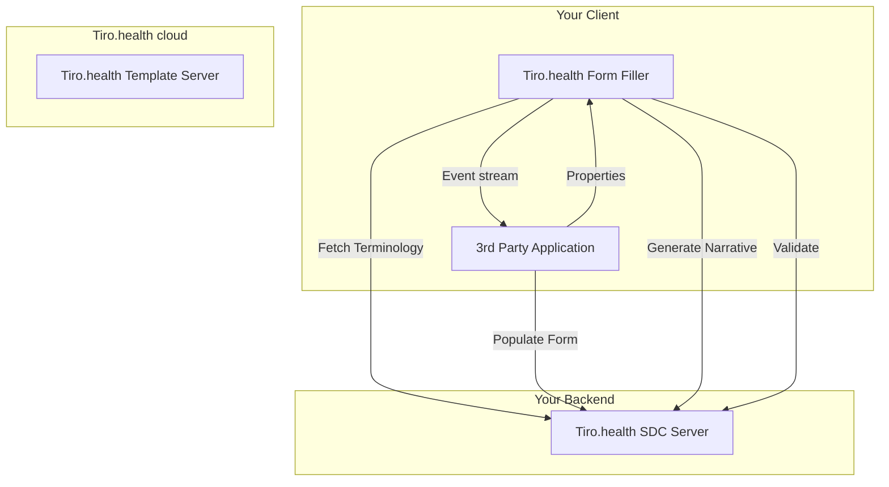
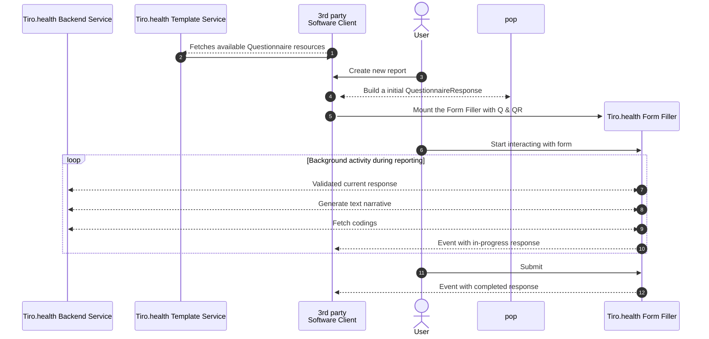

export const metadata = {
  title: 'Form SDK Introduction',
  description:
    'The Tiro.health Form SDK is a library and a set of docker images to integrate Tiro.health into your EHR or LIS.',
}
import { HeroPattern } from '@/components/HeroPattern'
import { Libraries } from '@/components/Libraries'

<HeroPattern />

# Form SDK

The Tiro.health Form SDK is a set of libraries and docker images to integrate Tiro.health into your EHR or LIS.
We provide a library compatible with your frontend framework to enable seamless UI integration and a set of docker images to run the processing services in your backend.{{ className: 'lead' }}

## Overview

The Form SDK consists of **two main components** that work together to provide structured data capture capabilities:

<section>
### 1. UI Component

The **UI component** handles the presentation layer:

- **Form rendering**: Interactive questionnaire display
- **Narrative display**: Human-readable form summaries
- **Validation feedback**: Real-time error and warning messages

</section>

<section>
### 2. Backend Service

The **backend** provides the data processing services:

- **Form retrieval**: Access to questionnaire definitions
- **Population**: Pre-filling forms with existing data
- **Validation**: Form response validation against questionnaire rules
- **Narrative generation**: Converting form responses to readable text
- **ValueSet expansion**: Resolving coded answer options

</section>

## FHIR API's

All Tiro.health services are built on top of the FHIR standard, which means you can use any FHIR client to interact with them.
The API's follow the [**Structured Data Capturing IG**](https://www.hl7.org/fhir/uv/sdc/index.html) standard, which is a set of FHIR profiles and extensions that standardizes how electronic forms are created, distributed, completed, and processed in healthcare systems.

## Architecture

Architecturally the Form SDK consists of the following subcomponents:

This diagram illustrates the high-level architecture of the Form SDK. On the client side, the Tiro.health Form Filler component handles the user interface for form completion, while your third-party application integrates with it. The Form Filler communicates with the Tiro.health SDC Server in your backend to fetch terminology, generate human-readable narratives, and validate form responses. Meanwhile, your application can populate forms with existing data via the SDC Server. The Form Filler sends an event stream of changes to your application, and your application configures the Form Filler through properties.

A typical session for a user filling out a form looks like this:

This sequence diagram shows the step-by-step flow of a form-filling session:

1. The user initiates the process by creating a new report in your application
2. Your client application communicates with the Population API to build an initial QuestionnaireResponse, possibly pre-filled with existing data
3. The client mounts the Form Filler component with the Questionnaire (Q) and QuestionnaireResponse (QR)
4. As the user interacts with the form, several background processes occur simultaneously:
			- The Form Filler validates responses through the Validation API
			- Text narratives are generated from the entered data
			- Terminology and codes are fetched when needed for structured data entry
			- The Form Filler continuously sends events with the in-progress response to your application
5. When the user completes and submits the form, a final event with the completed response is sent to your application for processing

This seamless interaction between components allows for real-time validation, narrative generation, and terminology support during the form-filling process.
