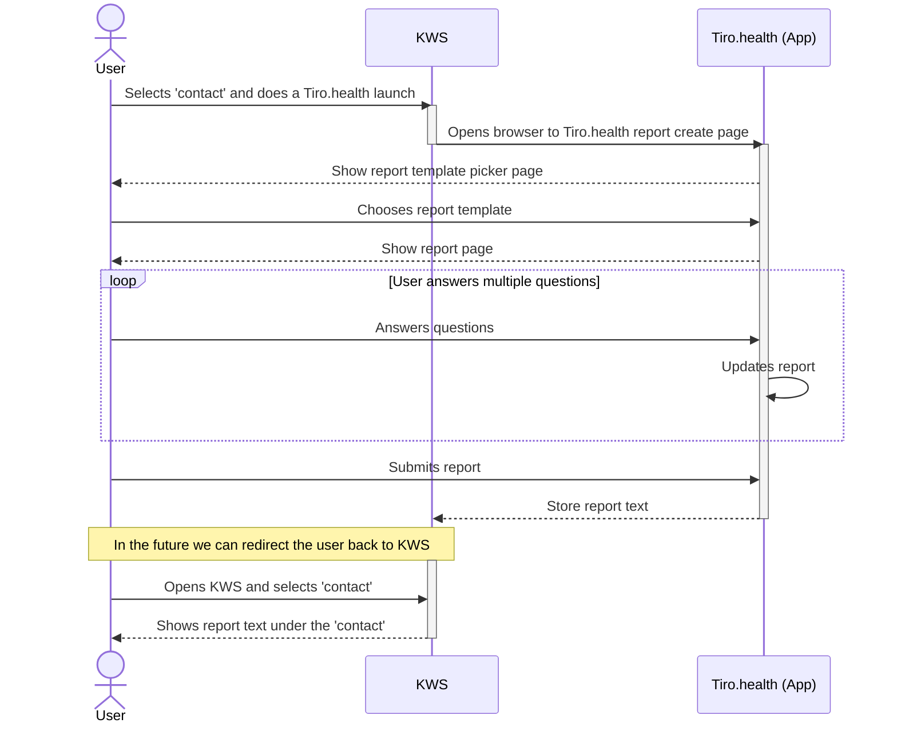

export const metadata = {
  title: 'Nexuzhealth KWS',
  description:
    'This page focuses on the UI integration in Nexuzhealth KWS applications.',
}

# Nexuzhealth KWS

Integrating Tiro.health with Nexuzhealth KWS allows healthcare providers to launch Tiro.health for a selected patient/encounter directly from KWS and save the resulting report back into the KWS system. This integration streamlines workflows and ensures patient data is centralized.

An integration typically consists of three phases:
- A data import phase, where data is retrieved from a source system and loaded into Atticus. The data is mostly metadata about the patient, the current encounter and the report that must be completed.
- A context launch phase, where a user opens the application on a specific patient and encounter. This is typically done by integrating a parametrized URL into the source system, which opens Atticus in the context of the patient and encounter.
- A data export phase, where data is sent back to the source system after the user has completed the report in Atticus. This is typically done by sending a FHIR QuestionnaireResponse resource back to the source system.

## Data Import and Context Launch

To facilitate the import of context data and enable the launch of Tiro.health, the following [MIRTH channel](https://github.com/Tiro-health/atticus-mirth/tree/main/channels/import/URL) is utilized. This channel intercepts a specific URL generated by the KWS External Viewer API and redirects the user to Tiro.health.

### Configuration
The KWS External Viewer API needs to be configured as follows:

* **Base URL:** The default base URL is `http://localhost/launch`. It's crucial that this URL matches the domain where the MIRTH server is running and that the path aligns with the MIRTH source listener configuration.

    **Important:** Since the URL transmits patient data, ensure the MIRTH channel is secured within your intranet or encrypted with TLS to protect sensitive information.

* **Parameters:** The following URL parameters are used to pass patient and encounter data from KWS to Tiro.health:

| **URL Parameter** | **KWS Value** | **Optional / Required** |
| :---------------- | :----------------------- | :---------------------- |
| `patient`         | `patient.eadnr`          | Required                |
| `encounter`       | `contact.cnr`            | Required                |
| `supervisor`      | `contact.supervisor.login` | Optional                |
| `user`            | `user.login`             | Optional                |
| `dob`             | `patient.birthDate`      | Optional                |
| `sex`             | `patient.gender`         | Optional                |

  **Note:** The mapping of these parameters is fully customizable within the MIRTH source transformer.

**Example of a final URL:**

`http://localhost/launch/?encounter=test-cnr3&dob=1941-12-12&sex=male&patient=test-ead3&supervisor=andrieskwslogin`

With this setup, users can select a contact in KWS and launch directly to app.tiro.health.

## Data Export

After a report is submitted in Tiro.health, it needs to be exported back to KWS. This is handled by two interconnected MIRTH channels:

1.  The [first MIRTH channel](https://github.com/Tiro-health/atticus-mirth/tree/main/channels/export/PollForQRs) periodically checks for newly submitted reports.
2.  Once a new report is detected, it is redirected to the [second MIRTH channel](https://github.com/Tiro-health/atticus-mirth/tree/main/channels/export/FHIRBundleToKWS), which then sends the report to KWS using the KWS Import XML API.

Hospitals will need to obtain a unique **'application identifier'** from Nexuzhealth for this export process.

Currently, only the plaintext human-readable report can be stored in KWS. Nexuzhealth KWS has no documented support for structured FHIR resources like QuestionnaireResponses, Conditions and Procedures. Tiro.health allows hospitals to archive these resources in a structured format in secondary systems like data warehouses or secured network drives. For more information, contact support@tiro.health.

## Sequence diagram

